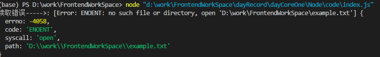

# Node 基础

## 使用严格模式

- 1. 在每个 JavaScript 文件开头写上'use strict'
- 2. 给 Node 传递一个参数，让 Node 直接为所有 js 文件开启严格模式
     > node --use_strict xxx.js

## 模块 Module

模块的好处：

- 大大提高了代码的可维护性，不必将所有源码都写在一个文件(.js)里。
- 可复用，当一个模块写完，可在其它地方被引用
- 还可以避免函数名和变量名冲突

## CommonJS 规范

向外暴露模块的变量，输出的变量可以是任意对象、函数、数组等

> module.exports = variable;

引用模块，相对路径

> var foo = require(module) // relative path

遇到问题 Cannot find moudle 'xxx'，检查

- 模块名是否写对了
- 模块文件是否存在
- 相对路径是否写对了

Node.js **实现“模块”功能**的奥妙就在于 Javascript 是一种函数式编程语言，它支持闭包。用一个函数将代码包装起来，让原本代码的“全局”变量变成了函数内部的局部变量，这样就实现了“模块”。

## Node 运行环境

Node 是运行在服务端的 Javascript 环境，服务器程序和浏览器程序相比，最大的特点就是没有浏览器的安全限制。

## global

Javascript 有且仅有一个全局对象，在浏览器中，叫 window 对象。而在 Node 环境中，也是只有唯一全局对象，但不叫 window，叫 global。

## process

process 也是 Node 提供的一个对象，它代表当前 Node 进程，通过 process 对象可以拿到很多有用信息。

**Javascript 程序是由事件驱动执行的单线程模型**，Node.js 也不例外。Node.js 不断执行响应事件的 Javascript 函数，直到没有任何响应事件的函数可以执行时，Node.js 就退出了。

如果我们想要在下一次事件响应中执行代码，可以调用 process.nextTick();

```js
process.nectTick(function () {
  console.log("nextTick callback");
});

console.log("nextTick was set!");
```

输出结果：

> nextTick was set!
> nextTick callback

可以响应 exit 事件，就可以在程序即将退出时执行某个回调函数：

```js
process.on("exit", function (code) {
  console.log("about to exit with code:" + code);
});
```

## 判断 Javascript 执行环境

有很多代码技能在浏览器中执行，也能在 Node 环境执行，有时候需要程序自身判断自己到底在什么环境下执行的，常用的方法如下：

```js
if (typeof window === "undefined") {
  console.log("node.js");
} else {
  console.log("borwser");
}
```

## Node.js API

https://nodejs.org/dist/latest-v18.x/docs/api

## 文件系统模块 fs

Node.js 内置的 fs 模块就是文件系统模块，负责读写文件。

和其它所有的 Javascript 模块不同的是，fs 模块提供异步和同步的方法。

### 异步方法

因为 Javascript 的单线程模型，执行 IO 操作时，JavaScript 代码无需等待，而是传入回调函数后，继续执行后续 Javascript 代码。常见的异步如 ajax 请求

```js
fetch("http:xxx.com/query", (data) => {
  console.log("请求结果返回后执行...");
});
console.log("不必等待上述请求完成，直接执行后续代码...");
```

而同步（Sync）的 IO 操作需要等待函数返回：

```js
const data = getJSONSync("http://example.com/ajax");
```

同步操作的好处是代码简单，缺点是程序将等待 IO 操作，在等待时间内，无法响应其它任何事件。而异步读取不用等待 IO 操作，但代码较麻烦。

### 异步读文件

> **语法: fs.readFile(path[, options], callback)**

```js
"use strict";

var fs = require(fs);
fs.readFile("example.txt", "utf-8", function (err, data) {
  if (err) {
    console.log(err);
  } else {
    console.log(data);
  }
});
```


由此可见文默认件路径为当前活动工作区。

异步读取时，callback 回调函数接收两个参数，err 和 data,正常读取时，err 为 null,data 为读取的内容。当读取错误时，err 为一个错误对象，data 为 undefined。

如果要使用相对路径的话，得配合 Node.js 的另外一个内置模块 path 使用。

```js
const fs = require("fs");

const path = require("path");

const read = (path, encodeing) => {
  fs.readFile(path, encodeing, (err, data) => {
    if (err) {
      console.log("读取错误----->:", err);
    } else {
      console.log("读取内容----->:", data);
    }
  });
};

read(path.join(__dirname, "../test/example.txt"), "utf-8");
```

普通字符串内容读取时，调用 data.toString() 或者传入编码格式“utf-8”
**如果不传入编码格式，回调函数 data 将返回一个 Buffer 对象**。在 Node.js 中，Buffer 对象就是一个包含零个或任意个字节的数组。（特别注意：和 Array 不同）

#### Buffer

Buffer 对象可以和 String 作转换：

```js
let text = data.toString("utf-8");
```

或者把一个 String 转换成 Buffer：

```js
let buf = Buffer.from(text, "utf-8");
```

### 同步读文件

> **语法： fs.readFileSync(path[, options])**

同步读取的函数和异步函数相比，多了一个 Sync 后缀，并且不接收回调函数直接返回结果。

如果同步读取文件发生错误,则需要用 try..catch 捕获错误：

```js
try {
  let data = fs.readFileSync("example.txt", "utf-8");
  console.log(data);
} catch (err) {
  console.log("出错了");
}
```

### 异步写文件

> **语法：fs.writeFile(file, data[, options], callback)**

writeFile() 的参数依次为文件名，数据和回调函数。如果传入的数据是 String，默认按 utf-8 编码写入文件，如果传入的参数是 Buffer,则写入的是二进制文件。回调函数只关心成功与否，所以只需要一个 err 参数。

```js
...其余省略
const file = path.join(__dirname, "../test/example.txt");
const write = (path, data) => {
  fs.writeFile(path, data, (err) => {
    if (err) {
      console.log("写入失败");
    } else {
      console.log("成功");
    }
  });
};

write(file, "你好啊，Node.js!");
```

注意：写入会覆盖源文件
fs.writeFileSync(file, data[, options])

### 同步写入文件

> 语法：fs.writeFileSync(file, data[, options])

```js
const writeSync = (path, data) => {
  fs.writeFileSync(path, data);
};

writeSync(file, "同步方法：你好啊，Node.js!");
```

同步方法失败的话会阻塞后续代码的执行

### Stat

如果我们要获取文件大小，创建时间等信息，可以使用 fs.stat(),它返回一个 stat 对象，能得到文件或目录的详细信息。

```js
const getFileInfo = (file) => {
  fs.stat(file, (err, stat) => {
    if (err) {
      console.log("获取失败----->", err);
    } else {
      console.log("isFile----->", stat.isFile);

      console.log("isDirectory----->", stat.isDirectory);

      if (stat.isFile) {
        console.log("size----->", stat.size);

        console.log("birth time----->", stat.birthtime);

        console.log("modified time----->", stat.mtime);
      }
    }
  });
};

getFileInfo(file);
```

由于 Node 环境执行的 Javascript 代码是服务器端代码，所以，绝大部分需要在服务器运行期反复执行业务逻辑的代码，必须使用异步代码，否则，同步代码在执行时期，服务器停止响应，因为 Javascript 只有一个执行线程。

服务器启动时如果需要读取配置文件，或者结束时需要写入到状态文件时，可以使用同步代码，因为这些代码只在启动和结束时执行一次，不影响服务器正常运行时的异步执行。

https://www.liaoxuefeng.com/wiki/1022910821149312/1023025800783232
