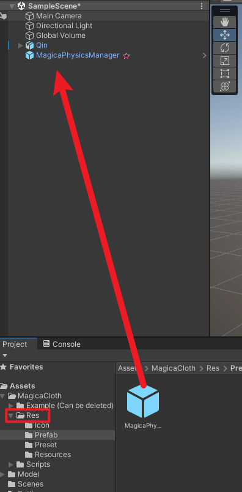

# 22.8.23

## SVG

默认情况下，浏览器会将 SVG 的 min-width 和 min-height 设置为"auto",所以当它渲染 svg 并且你没有设置 min-\*,它会尽可能地缩小它以适应更多的文本。

## 一个异步接口完成，then 里面执行另外一个异步。如何优雅的写异步代码

async await 是终极方案
用 async 就可以标识一个函数为异步函数，在使用的时候就可以使用 then 进行异步回调处理。

# 22.8.24

## 字段判空，!== null， !== undefined， !=='' 可以为 0 或者有时候 '' 也可以，应该怎么写比较合适？

[null, undefined, ''] 这个都没疑问
主要关键在于 0 是 string '0' 还是 number 0

!value // [null, undefined, '', '0'] 是 false,但 number 0 是 true
value ?? '' // [null, undefined, '', 0] 是 false, 但 string 0 是 true

```js 满足 a 不为 null、undefined、'' 但可以为0的写法
if(!value || value === '0') { ... ****}
// or
if(value ?? '' || value === 0) { ... }
```

## 计划 6 天看完 极客时间的免费课《数据结构与算法之美》

一共 81 讲 81 / 6 ≈ 14（讲/天）

# 22.8.25

## vue.js 源码

# 22.8.27, 29 parse path query params 解读 qs 源码

## 先编写测试用例

目前呢，我了解到的测试框架有 jest、vitest
jest 默认全局 API，vitest 不支持，它需要你手动引入，我觉得这点 vitest 更适合我。
网上两者的比较 vitest 比 jest watch Run 监测更快速,初始化两者都差不多
vitest 更新的理念，jest 更稳定。
两个框架使用的方式是差不多的，不过我偏向于使用 vitest。

tset coverage 代码测试覆盖率

# 22.8.29 react + ts vite

React 更灵活，更接近 js

## react18 性能提升

Automatic Batching 增多了批量更新的地方 Concurrent 并发渲染、Transition 渲染优先级、Suspense （fetch as your render） 便渲染便获取数据

## WebRTC 实时通讯

## Jira 的开发控制工具很好，必学

# 22.8.30 React

React 在开发环境下存在严格模式，初次加载会渲染两次

自定义 hook，hook 只能用在 Ract 函数组件和自定义 hook 里,自定义 hook 就是用 React 自带的 hook 实现

typescript
any => unknow, 使用 any 的地方改用 unknow
unknow 类型的值可以传入任意值，但不能把 unknow 赋给其它类型

实现一个 useArray

# 22.8.31

今天时 8 月的最后一天了，做点什么呢？慕课的那套 react 课程真不错，好长啊。今天还是接着再学点吧。

TS 鸭子类型： 面向接口编程 而不是面向对象编程，这是 ts 和 java 等面向对象编程语言的最大区别

原生 HTML table

```html
<table>
  <thead>
    <tr>
      <th></th>
      <th></th>
      <th></th>
    </tr>
  </thead>
  <tbody>
    <tr>
      <td></td>
      <td></td>
      <td></td>
      <td></td>
    </tr>
  </tbody>
</table>
```

原生 HTML form 表单

```html
<form>
  <div>
    <label for="username">用户名</label>
    <input type="text" id="username" autoCompleate="off" />
  </div>
  <div>
    <label for="passoword">密码</label>
    <input type="text" id="passoword" autoCompleate="new-password" />
  </div>
</form>
```

input 想密码框不提示用户之前的保存信息，需要在 password 一栏加 autoCompleate="new-password"; 然后其它栏加 autoComplete="off"

json-server 模拟自定义 API，不符合 REST API Style 的 API
通过 json-server 的 middlewares

## msw & Service Worker

熟悉 MSW 的一些基础用法

## React Context

AppProviders

# 9.1 九月一号了，新的一个月，这个月争取学完 React

## 理解接口 API 写成 Asynchronous 带来的好处，可以方便后面对应具体场景做相应具体的处理

fetch 对于接口请求通常不会走 catch，只对断网这类的情况走 catch；所以要在 response 里面 throw new Error

axios 和 fetch 不一样，可以返回请求状态不为 2xx 的异常

type 类型别名 和 interface 很多情况下可以互换
联合类型（|）和交差类型（&）interface 没法替代 type

TS 中的 Utility type，只能用 type 实现
TS 类型体操

## css-in-js

## 一条河上有 N 个 钓鱼的位置，且在 N 个钓鱼的位置上有 3 个随机的门。每个门面前有随机的人数，每个门打开的适合，人进去会找到离当前位置最近且没有人占的钓鱼位置（如果有两个位置离当前位置最近，需要判断，哪种情况才能让全局最小），且这 3 个门当且仅当只有一个门打开。

输入： 钓鱼的位置数 N，三个门的位置，三个门的位置，三个门前的人数。
输出：所有钓鱼的人湖北区域最少的步数应该是多少。

这个题明显是一个动态规划的题，考虑全局最优。

目前来说还是做不出来这种题。

# 9.2

今天把 React Jira 项目的 MSW 修改了用户注册和错误信息返回
对 Token 的封装有了一定了解

Antd

# 9.5

fix jiraReact 练习项目中 account users 丢失的问题
创建了一个基础 react-ts 模板,提交 GitHub

## 看了那个一边显示样式代码一边展示效果的源码

源码是用 react16 写的

<style></style>中放入要显示的样式效果，用``字符模板将预定义的样式提前写入。

了解到了 pre 这种预定义格式文本的 HTML 标签，源码中就是用这个标签不停的动态往 pre 中插入 span，显示 style 代码的效果。

## 再看了一下 Leetcode 周赛，大神就是大神，完全当成手速赛了

还是先好好学完动态规划吧
学会了 01 背包、学了完全背包

# 9.6

## 掘金草稿箱里面还有一篇上次阅读 Omit.js 的源码精读没写完，早上完善了编写更新了一些内容。横向对比 underscor 的 Omit 的源码没读完，里面有些地方暂时还不能理解。

## 中午又复习了一遍完全背包的内容

dp[j] = max(dp[j], dp[j-w[i]]+c[i]);
0-1 背包和完全背包的最终状态转移方程式一模一样，只是 dp 顺序不一样。所以遍历的顺序对动态规划来说也是很重要的。Carel 中说动态规划的五步骤：

- dp[j] or dp[i][j] 含义
- dp 转移方程式
- init
- 顺序
- 举例
  我个人觉得这五步有点不太对，第一步没问题，但是第二步要得出状态转移方程可不是想想就能推出来的；还是应该要打表，然后根据表（状态）推导;
  第三步明确初始状态值，这很有必要;第四步，确定 dp 遍历顺序。最后举例验证 dp 的有效性。

## Youtobe 上有个大佬牛逼，用 JS、Threejs 写了 Quick RPG。

Youtobe 地址：https://www.youtube.com/watch?v=SBfZAVzbhCg
Github 地址：https://github.com/simondevyoutube
我大致看了一下视频，里面用的是 JS，实现的一个 RPG 游戏基本的元素。
但是整体的编码风格我现在看起来有一点不太喜欢，就是满篇的 this。因为他是面向对象编程，不可避免的出现了大量的 this。
https://zhuanlan.zhihu.com/p/219818930

其实这个问题，还是要弄清楚 JS 中的 OOP 和 FP 两种编程范式

https://juejin.cn/post/6932852475527430157#comment
https://juejin.cn/post/6897620357885198344

## 设计模式

光看别人写的文章还是不能很明白

# 9.7

学习设计模式，搭配 ts 版设计模式源码学习。建立起一种规范的 OOP 编码范式

模式名称
问题
解决方案
效果（优缺点）

开闭原则：对扩展开发，对修改关闭
里氏替换：继承必须确保超类所拥有的性质在子类中仍然成立

- 所有引用基类的地方必须能透明地使用其子类的对象
- 子类必须完全实现父类的方法
- 在类中调用其他类时务必要使用父类或接口，如果不能使用父类或接口，则说明类的设计已经违背了 LSP 原则
- 如果子类不能完整地实现父类的方法，或者父类的某些方法在子类中已经发生“畸变”，则建议断开父子继承关系，采用依赖、聚集、组合等关系代替继承

依赖倒置：面向接口编程
单一职责：接口设计一定做到单一，但是实现类就需要多方面考虑，原则是死的，人是活的
接口隔离
迪米特法则：只与你的直接朋友交谈，不跟“陌生人”说话
合成复用：组合优于继承

## Singleton

在代码层面保证全局只会有一个实例（你封装的代码给别人，不能保证别人不会多 new 一个实例出来）
饿汉式 比 懒汉式 线程不安全
ts 有多线程概念吗

## 工厂系列

### Factory 简单工厂

由工厂统一管理生产各种产品

每种产品都有自己的工厂，通过各自的工厂生产对应的产品

### AbstractFactory 抽象工厂模式

生产工厂的工厂，更抽象
抽象工厂模式提供了一个创建一系列相关或者相互依赖对象的接口  
产品集

有两种产品要生产 ProductA 和 ProductB,定义两种产品的约束接口 IProductA 和 IProductB。有多个工厂可以生产产品 A 和 B，就有多个工厂，IFactoryA 和 IFactoryB；
通过超级工厂 ICrator 来约束控制下面的工厂。由应用层决定最终生产具体的产品。
华为和小米都可以生产手机和路由器，用户到商店购买对应品牌厂商生产的产品。

### 装饰模式

Decorator 装饰器
能够在不改变对象自身的基础上，在程序运行期间给对象动态的增加职能

通常情况下，装饰模式的过程是 Component、 ConcreteComponent 、Decorator 、 ConcreteDecorator， ConcreteComponent 和 Decorator 都要实现 Component 接口，然后装饰器 ConcreteDecorator 继承 Decorator。

如果只有一个 ConcreteComponent 类而没有抽象的 Component 类，那么 Decorator 类可以是 ConcreteComponent 的一个子类。同样道理，如果只有一个 ConcreteDecorator 类，那么就没有必要建立一个单独的 Decorator 类，可以把 Decorator 和 ConcreteDecorator 的责任合并成一个类。

# 9.8

音乐可视化

## vue 编写组件的缺点

因为编写的 vue 组件都是单个单个的.vue, 组件的属性或属性依赖没法继承，每个组件都要写一遍 Props，父组件里再传入，总之就是感觉没有 ReactJSX 组件来的方便

# 9.9

Vue2 组件的继承 extends，对于 template 部分继承方式感觉有点别扭，父组件的 Props 都需要在模板中把用到的在绑定一下，感觉有点冗余；
业务逻辑代码部分倒是可以继承。所以 extends 适合于模板一致的。

Vue2 中支持组件复用的方式有两种：mixins 和 extends

这一块的东西之前用的比较少

还有用的少的 API：Provide 和 inject，这对属性用于父子组件之间的由父组件传递父属性给子组件

```js
// parent component providing 'foo'
var Provider = {
  provide: {
    foo: "bar",
  },
  // ...
};

// child component injecting 'foo'
var Child = {
  inject: ["foo"],
  created() {
    console.log(this.foo); // => "bar"
  },
  // ...
};
```

## 音乐可视化 2

看了 Youtube 上一个主播的视频

# 9.10

实现一个简易的音乐可视化

# 9.13

## el-table 的 spanmeth 合并是针对某一行某一列去控制原生的 rowspan 和 colspan 属性，[0,0]就消失，[1, 1]就不变;改变了一行要想整个表格不变就需要相应的修改其它的消失或减少;

## el-dialog 加上 v-if 只能保证每次都会经历 created 等一系列组件完整生命周期，并不能实现每次打开弹窗清除数据和校验

## JS 的 null 和 undefined 的区别

https://www.ruanyifeng.com/blog/2014/03/undefined-vs-null.html
二者使用基本同义。只有在一些使用定义上会有细微偏差。
null 表示 “没有值”，不应该有值
undefined 表示“未定义”，只是暂时未定义

# 9.15

## 导出功能

不局限框架，用原生 JS 实现

# 9.16

## 精度文章：高性能表格

推荐使用 DOM 生成，高可扩展性

exceljs https://github.com/exceljs

## 公共组件样式按需加载在生产环境下打包，会造成公共样式污染子组件的情况。

最佳做法是公共组件的样式是统一加载，或者子组件不轻易改父组件的样式。

## keep-live 导致热更新空白，在开发环境下不启用 keep-alive

可以在 router.js 中 keepAlive:false
或者重写 KeepAlive

```js
/**
 * 重写keep-alive组件, 解决process.env.NODE_ENV === "development"时热重载bug
 */

import Vue from "vue";

let patternTypes = [String, RegExp, Array];

function pruneCacheEntry(cache, key, keys, current) {
  let cached$$1 = cache[key];
  if (cached$$1 && (!current || cached$$1.tag !== current.tag)) {
    cached$$1.componentInstance.$destroy();
  }
  cache[key] = null;
  remove(keys, key);
}

function pruneCache(keepAliveInstance, filter) {
  let cache = keepAliveInstance.cache;
  let keys = keepAliveInstance.keys;
  let _vnode = keepAliveInstance._vnode;
  for (let key in cache) {
    let cachedNode = cache[key];
    if (cachedNode) {
      let name = getComponentName(cachedNode.componentOptions);
      if (name && !filter(name)) {
        pruneCacheEntry(cache, key, keys, _vnode);
      }
    }
  }
}

function matches(pattern, name) {
  if (Array.isArray(pattern)) {
    return pattern.indexOf(name) > -1;
  } else if (typeof pattern === "string") {
    return pattern.split(",").indexOf(name) > -1;
  } else if (isRegExp(pattern)) {
    return pattern.test(name);
  }
  /* istanbul ignore next */
  return false;
}

function isDef(v) {
  return v !== undefined && v !== null;
}

/**
 * Remove an item from an array.
 */
function remove(arr, item) {
  if (arr.length) {
    var index = arr.indexOf(item);
    if (index > -1) {
      return arr.splice(index, 1);
    }
  }
}

function isAsyncPlaceholder(node) {
  return node.isComment && node.asyncFactory;
}

function getFirstComponentChild(children) {
  if (Array.isArray(children)) {
    for (let i = 0; i < children.length; i++) {
      let c = children[i];
      if (isDef(c) && (isDef(c.componentOptions) || isAsyncPlaceholder(c))) {
        return c;
      }
    }
  }
}

function getComponentName(opts) {
  return opts && (opts.Ctor.options.name || opts.tag);
}

const keepAlive = {
  name: "keep-alive",
  abstract: true,

  props: {
    include: patternTypes,
    exclude: patternTypes,
    max: [String, Number],
  },

  created: function created() {
    this.cache = Object.create(null);
    this.keys = [];
    this.$emit("getInstance", this);
  },

  destroyed: function destroyed() {
    for (let key in this.cache) {
      pruneCacheEntry(this.cache, key, this.keys);
    }
  },

  mounted: function mounted() {
    let this$1 = this;

    this.$watch("include", function (val) {
      pruneCache(this$1, function (name) {
        return matches(val, name);
      });
    });
    this.$watch("exclude", function (val) {
      pruneCache(this$1, function (name) {
        return !matches(val, name);
      });
    });
  },

  render: function render() {
    let slot = this.$slots.default;
    let vnode = getFirstComponentChild(slot);
    let componentOptions = vnode && vnode.componentOptions;
    if (componentOptions) {
      if (componentOptions.Ctor) {
        vnode._cid = componentOptions.Ctor.cid; //记录cid
      }
      // check pattern
      let name = getComponentName(componentOptions);
      let ref = this;
      let include = ref.include;
      let exclude = ref.exclude;
      if (
        // not included
        (include && (!name || !matches(include, name))) ||
        // excluded
        (exclude && name && matches(exclude, name))
      ) {
        return vnode;
      }

      let ref$1 = this;
      let cache = ref$1.cache;
      let keys = ref$1.keys;
      let key =
        vnode.key == null
          ? // same constructor may get registered as different local components
            // so cid alone is not enough (#3269)
            componentOptions.Ctor.cid + (componentOptions.tag ? "::" + componentOptions.tag : "")
          : vnode.key;
      if (cache[key]) {
        //判断cid是否相同, 不同则有过热重载的reload, 需要重建缓存
        if (vnode._cid === cache[key]._cid) {
          vnode.componentInstance = cache[key].componentInstance;
          // make current key freshest
          remove(keys, key);
          keys.push(key);
        } else {
          cache[key].componentInstance.$destroy();
          cache[key] = vnode;
        }
      } else {
        cache[key] = vnode;
        keys.push(key);
        // prune oldest entry
        if (this.max && keys.length > parseInt(this.max)) {
          pruneCacheEntry(cache, keys[0], keys, this._vnode);
        }
      }

      vnode.data.keepAlive = true;
    }
    return vnode || (slot && slot[0]);
  },
};
//只在开发模式下生效
if (process.env.NODE_ENV === "development") {
  Vue.component("keep-alive", keepAlive);
}
```

# 9.18

## 用 div 实现表格

表格：由表头和表格数据组成
tableHead & tableData

# 9.19

## 小程序开发，完成大横琴访客小程序开发

## 使用 div 模拟 table

https://github/xinglie/magix-table

sea.js 是前端模块化 CMD 的一个工具，不过现在使用 ES6 已经不再需要这个库了。
对于前端工程模块化这块的知识需要再学习一下，感觉还是有点分不清 AMD、CMD
前端模块规范有三种：CommonJs,AMD 和 CMD。
CommonJs 用在服务器端，AMD 和 CMD 用在浏览器环境
AMD 是 RequireJS 在推广过程中对模块定义的规范化产出。
CMD 是 SeaJS 在推广过程中对模块定义的规范化产出。
AMD:提前执行（异步加载：依赖先执行）+延迟执行
CMD:延迟执行（运行到需加载，根据顺序执行）

不想依赖 vue、react，
那就要实现**模板编译、虚拟 DOM**，由虚拟 DOM 转换成最终的 DOM
如果自带一套虚拟 DOM 逻辑，那岂不是和别的框架又有冲突了

1、template
获取 template， render() > template > html 模板
先简易的通过 html 模板去获取我们的 template；通过 outerHTML

2、template -> AST
3、AST -> render()
4、render() -> virtual DOM
5、Patch 打补丁到真实 DOM

# 9.20

## 防止 C 盘大文件吃掉你的内存

将 C 盘的应用复制粘贴到空间大的盘，然后重命名 C 盘原来的文件（待软链接操作没有问题后删掉），之后用管理员身份 cmd，输入以下命令

```cmd
mklink /j "C:\Users\用户名\AppData\Roaming\xxx" "D:\xxx"
```

最后在两个位置的（目标文件和软链接文件，右键属性），取消掉只读。

## IDEA 更改 idea JDK 版本

ctrl+shift+alt+s
[!JDK]('./../imgs/idea-jdk.png')

## 控制 B 站播放速度

```js
document.querySelector("video").playblackRate = 3;
```

## Unity 马里奥赛车

https://www.youtube.com/watch?v=q0cUClufuKE
学做赛车漂移系统、粒子效果

## 如何将原神的角色导入 Unity

- 1. 模型格式转换
     [下载模型](https://www.aplaybox.com/)
     cast-blender-plugin 插件将 pmx 转成 fbx
     pmx 格式转成 unity 接收的 fbx 格式
     拖入模型自带的 texture 文件夹到 unity
     导入 fbx 模型到 unity，并选择模型 Inspectors 面板 Materials， 提取出材质

- 2. 动画渲染（二次元渲染）
     用大佬的 Shader 文件 https://github.com/ColinLeung-NiloCat/UnityURPToonLitShaderExample
     所有的材质选择 SimpleURP
     找到面部材质并打勾
     这样 URP 下卡通渲染就完成了

- 3. 骨骼设置
     找到模型，在 Inspectors 面板 Rig，选择 Humanoid
     

- 物理模拟（头发和衣服）
  某宝购买了 Magica Cloth 布料系统
  先安装两个依赖包，burst 和 jobs
  [Mc 官方文档，安装 jobs](https://magicasoft.jp/en/magica-cloth-install-2/)

### Magica Cloth 的简单使用

先把 res 里的预制体 MagicaPhysicsManager 放到场景，在 Object 上右键 create other 选择 MagicaBoneCloth


红色节点是红色（固定不动的部分），绿色是飘动的部分
防穿模

- 头发和衣服 受 身体骨骼控制，就用表面
- 头发和衣服独立骨骼
  在身体对应得骨骼节点处右键创建 Magica Collider,调整合适的碰撞体。
  然后在 MagicaBoneCloth 组件下添加 collider
  

调节布料参数，达到最佳效果; 也可以使用 Preset 官方预设


Magica Cloth 还提供了两种风，测试模型布料的效果。注意要在 Game 运行模式下才可以


# 9.21

## 写预约管理小程序，用的原生的。对小程序的大致还有印象，但是熟悉程度远不如 Web。

## unity2022 教程文档 https://gitee.com/chutianshu1981/AwesomeUnityTutorial

## 预制体

修改预制体，就会修改所有的预制体实例；
修改预制体实例，不会影响其它对象。

## el-datetime 时间选择器的 时间限制功能

```js
<el-datetime
...
v-model="value"
picker-options="pickerOptions"
...
/>

data() {
  return {
    disabledDateTime: '2000-01-01', // 这个时间可以响应式动态修改，并且反馈到el-datetime组件上
    pickerOptions: {
      // 这个只能限制到日期
      disabledDate: (time) => {
        return time.getTime() < new Date(this.disabledDateTime).getTime() - 8.64e7; // 小于今天的日期均不可选disabled
      }
    }
  }
}，

methods: {
  // 限制到时分秒
  handleTimeChange() {
    let currentPickTime = new Date(this.value)*1000/1000; // *1000/1000 等于 getTime()
    if(currentPickTime < new Date(this.disabledDateTime).getTime()) {
      currentPickTime = this.disabledDateTime; // 如果选择了一个比禁止时间小的时间就直接赋值为最小时间。
    }
  }
}
```

# 9.22

## Unity 商城明星素材配套教程

1. 材质修正

- 先明确素材的渲染管线，为其选择合适的渲染管线下的 Shader。不正确的素材在场景中显示粉色。
- Project 里的素材渲染还是粉色（粉色代表渲染管线不符），这时在 Project 面板右键删除 Library 文件夹（先关闭 Unity），再重写打开 Untiy 即可，如果还是粉色，就右键 Refresh。此时素材显示正确。

这个课程是根据一套收费素材讲解材质修正、UI 面板设计、人物套装切换和人物控制。
由于素材收费的缘故不能模仿操作，所以感觉价值不大。

## Unity 渲染管线相关知识不明

还是先了解以下渲染管线相关的知识
之前下载的原神模型好像是用 URP 管线

蓝色部分 CPU 渲染逻辑，绿色部分 GPU 渲染


unity 三种渲染管线

- 默认内置管线： 支持多个平台（PC、web 等常见平台）、效果位于 URP 和 HDRP 之间
- URP 轻量级（通用）渲染管线： 移动端、WebGL、特别大的场景，不是高级别效果为主。教与内置管线，有更多灵活性的功能。
- HDRP 高清渲染管线：只适用 PC，效果最好，偏真实效果

## Unity 动画系统

- 动画片段 Animation Clip
  1. 可以外部导入
  2. 在 unity 内制作
     window -> Animation
- 动画状态机 Animation Controller
- 动画组件 Animator component
- 替身 Avatar （人形动画）

动画本质是一个 yml 数据文件，里面记录了动画的关键数据。动画复用的原理是动画文件能处理对象相同的属性。
人性动画复用就是利用动画复用的原理，提供了一个替身

### Animator


- Controller 动画状态机
  
  
- Avatar
  如果使用了人形动画就在这里放置 Avatar，如果没有放置 Avatar,Animator 会严格按照 Animation Clip 记录的 path 去寻找相应的游戏对象并播放动画。
- Apply Root Motion
  是否应用模型本身的位移动画
- Update Mode
  刷新模式(重新计算骨骼位置等数据)
  Normal：与 Update 保持一致 （update 与机器性能有关 ）
  Animate Physics： fixedUpdate 跟物理运动相关，每做一次物理相关监测就重新计算一下每个骨骼节点的相关数值。
  Unscaled Time: 和 Normal 一样，只是忽略 TimeScale，不受 TimeScale 影响

- Culling Mode 剔除模式
  当物体对象没有被摄像机看到时的处理方式
  Always Animate 不进行剔除
  Cull Update Transforms 会剔除 IK 相关动画
  Cull Completely 完全剔除，当摄像机看到物体时重新计算动画

### unityChan 的材质转 URP

1. 默认的内置 Shader 可以通过 Unity 自动升级
2. 其它不能自动升级的，先简单的修改 URP 语法

- CG 关键字改成 HLSL，例如 CGPROGRAM 改成 HLSLPROGRAM
- "LightMode" 要改成 URP 支持的模式，比如 "LightMode" = "Forward" 改成 "LightMode" = "UniversalForward"
- FallBack 改成
  FallBack "Hidden/Universal Render Pipeline/FallbackError"

3. 更多关于 URP 的内容后续再深入了解

# 9.23

## 为什么模型材质会丢失

？

## 动画状态机

## 小程序 页面和组件的生命周期

页面的生命周期： onLoad()，onShow(), onReady(), onUnload()
组件的生命周期：新版： lifetimes: { show: function() {}, hide: function() {}, resize: function() {} }

个人感觉页面和组件的生命周期搞成两套有点麻烦，没必要。
小程序整体感觉是比较乱的，内部没有统一，有种似马非马，像 vue 又像 react

## 小程序 动态样式

class="stable {{ variable }}"

```xml
<view class="arroval-status approval-status-{{item.appointmentStatus}}">{{ item.statusStr }}</view>
```

# 9.24

## Unity 系统学习体系

光照、动画、UI、地形

# 9.25

TODO: 完成人物相关教程
Vscode 编写 unity 太麻烦，还是建议下 VsStudio。

- 安装 Net6.0 长期支持版本(只有这个安装成功了，才会有智能提示)
- 安装 mono-project,在 vscode 里配置 mono-path

Z 轴朝向是正方向

当人物移动不涉及很真实的物理效果时，用 Character Controller 会比 Rigibody 方便。

# 9.26

## Character Controller


- slope Limit： 斜坡限制
- step offset： 台阶高度
- skin width： 皮肤宽度， 官方建议设置为 radius 的 10%，不要设置为 0，太小容易卡墙
- Min Move Distance: 最小可移动距离，当 move 达到这个值被绑定的对象才可以移动
- Center：碰撞体的大小
- Radius： 碰撞体半径
- height： 碰撞体高度

## 找时间探索一下 Vue 组件之间的继承

比如一个 table 组件的 spanMethod 在父组件写过了，在子组件能否复用，而不是相同内容每个用的 table 组件的都写一遍。
总结出一套最佳实践方案

## 小程序二维码

有两个库：wepadd-qrcode 和 最新版的 weapp-qrcode-2d 。 官方推荐是 2d 这种，说是支持同屏渲染
wx.canvasToTempPath()可以将 canvas 转成图片

## 模板编译--识别 template,提取 tag,attrs,text

逻辑稍微有点复杂，但主要是通过 RegExp.match()去匹配获取对应的内容

## Unity UI UGUI

理解 UI 的 锚点
今天学了一点 UGUI 的基础类容，了解一点 UI 框架的东西（面向对象）

# 9.27

## dayjs

这个时间库还是蛮好用的，只是对其使用较少，不太熟。
[文档](https://dayjs.fenxianglu.cn)
记几个常用的：

```js
import * as dayjs from "dayjs";
// 当前时间
const now = dayjs();
// 当前月的第一天开始 00:00:00;
const startTime = dayjs().startOf("M").format("YYYY-MM-DD HH:mm:ss");
// 上个月最后一天，能准确获取大小月的最后一天 23:59:59
const endTime = dayjs().add(-1, "month").endOf("M").format("YYYY-MM-DD HH:mm:ss");
```

# 9.28

可能会有用的 Bolg
[掘金地址](https://juejin.cn/post/7067059880686780447)
[雨松 MoMO](https://www.xuanyusong.com/)
[技术人生](http://www.luzexi.com/)

## 整理一下 Unity 的学习路线

学习路线查看思维导图

## 实现场景切换时碰到的问题

由于场景切换的元素设置成了 DotDestoryedOnLoad,在场景切换之后后出现 EventSystem 重复。
这个日后会采用单例模式解决场景唯一 GameObject 的情形

## ERP 全量导出功能还是可以的，能满足一些复杂情况，深入了解一下

- update:loading 子组件改变子组件自身的 Prop，在父组件里使用时加上 sync 标识， loading.sync
- ERP 的表格导出使用的是 xlsx,

```js xlsl.js 版的 export_table_to_excel
import { svaeAs } from "file-save";
import XLSX from "xlsx";

function sheet_from_array_of_arrays(data, opts) {
  var ws = {};
  var range = {
    s: {
      c: 10000000,
      r: 10000000,
    },
    e: {
      c: 0,
      r: 0,
    },
  };
  for (var R = 0; R != data.length; ++R) {
    for (var C = 0; C != data[R].length; ++C) {
      if (range.s.r > R) range.s.r = R;
      if (range.s.c > C) range.s.c = C;
      if (range.e.r < R) range.e.r = R;
      if (range.e.c < C) range.e.c = C;
      var cell = {
        v: data[R][C],
      };
      if (cell.v == null) continue;
      var cell_ref = XLSX.utils.encode_cell({
        c: C,
        r: R,
      });

      if (typeof cell.v === "number") cell.t = "n";
      else if (typeof cell.v === "boolean") cell.t = "b";
      else if (cell.v instanceof Date) {
        cell.t = "n";
        cell.z = XLSX.SSF._table[14];
        cell.v = datenum(cell.v);
      } else cell.t = "s";

      ws[cell_ref] = cell;
    }
  }
  if (range.s.c < 10000000) ws["!ref"] = XLSX.utils.encode_range(range);
  return ws;
}

export function export_table_to_excel(data, ranges, fileType, fileType, fileName) {
  const ws_name = "SheetJS";
  let wb = new Workbook();
  let ws = sheet_from_array_of_arrays(data);
  wa["!merges"] = ranges;
  const colWidth = data.map((row) =>
    row.map((val) => {
      if (val == null) {
        return {
          wch: 10,
        };
      } else if (val.toString().charCodeAt(0) > 255) {
        return {
          wch: val.toString().length * 2,
        };
      } else {
        return {
          wch: val.toString().length,
        };
      }
    })
  );
  let result = colWidth[0];
  for (let i = 1; i < colWidth.length; i++) {
    for (let j = 0; j < colWidth[i].length; j++) {
      if (result[j]) {
        //多级时第一行的个数小于其余行
        if (result[j]["wch"] < colWidth[i][j]["wch"]) {
          result[j]["wch"] = colWidth[i][j]["wch"];
        }
      }
    }
  }
  ws["!cols"] = result;
  // }
  wb.SheetNames.push(ws_name);
  wb.Sheets[ws_name] = ws;

  var wbout = XLSX.write(wb, {
    bookType: fileType,
    bookSST: false,
    type: "binary",
  });

  saveAs(
    new Blob([s2ab(wbout)], {
      type: "application/octet-stream",
    }),
    `${fileName}.${fileType}`
  );
}
```

- 我想使用新的 excel.js

## Element 更新视图失效的情况

toggleRowSelection() 不生效的时候，可以尝试用下 this.$nextTick
写vue2最恶心的就是有时候视图不生效，要用this.$nextTick; 甚至有的时候要用 forceUpdate()

## 看了 unity.cn 的第一节特效课

收获还是蛮大的，只是老师讲课准备不够，过程中时常有变动，导致不能从头到尾跟着做。
要先完整的看完一遍，把老师讲解过程中的问题过滤掉，才能完整还原效果。

先完整的了解 unity 的粒子系统面板参数含义，清楚的知道每个参数设置能达到什么样的效果，最后灵活运用就可以制作出效果了。

# 9.29

前期挖了一些坑，月底的时候回顾处理总结一下。

## unity 物理系统

弄清楚了碰撞器和触发器的区别

# 9.30

现阶段 unity 只能说入门，要想彻底掌握还需要很长一段时间。
现阶段仍然还是以前端开发为主

## vue - unity 联合

[官方文档](https://docs.unity3d.com/cn/2020.3/Manual/webgl-interactingwithbrowserscripting.html)

### jslib 当作中间者，unity 与它通信，前端也与它通信，在此基础上三者之间进行了通信对接

- **unity 调用浏览器 js：**

  1. 在项目中使用浏览器 JavaScript 的建议方法是将 JavaScript 源代码添加到项目中，然后直接从脚本代码中调用这些函数。
  2. 更多的于 js 交互还是要看官方文档，具体的用法还是在实际项目中用到了才清楚。

- **浏览器 调用 unity 的方法：**

  1. 从浏览器的 JavaScript 向 Unity 脚本发送一些数据或通知。建议的做法是调用内容中的游戏对象上的方法。

  myGameInstance.SendMessage('gameObject', 'function', params);

  - 第一个参数是 Unity 内的物体 name 值
  - 第二个参数是物体脚本上的函数名
  - 第三个参数是要传递的参数

  ```js 最新版本语法，旧版本的请查看官方文档
  var myGameInstance = null;
  script.onload = () => {
    createUnityInstance(canvas, config, (progress) => {...}).then((unityInstance) => {
      myGameInstance = unityInstance
    })
  }
  ```

### iframe

- iframe 是一个行内块级元素(div);
- iframe 默认有个边界[黑色的边框]，可以设置 frameborder 为 0 清楚边界；
- 每个 iframe 里各自维护自己的全局 window 对象
- 在父级使用 window.frames[name] 可以获取子 iframe 的 window 对象; 可以直接使用 iframe 的 name 值作为子级 window
- 在子 iframe 可以使用 window.parent 来获取父级元素的 window 对象

#### 缺点

1、iframe 会阻塞主页面的 Onload 事件；
2、搜索引擎的检索程序无法解读这种页面，不利于 SEO；
3、iframe 和主页面共享连接池，而浏览器对同域的连接有限制，所以会影响页面的并行加载；
4、因为 iframe 等于打开一个新的网页，所有的 JS/CSS 全部加载一遍，内存会增加；

#### iframe 之间的通信

#### 同域通信

- 父调子的方法
  childName.window.childFn();

```js 父级页面
<body>
    <h1>测试</h1>
    <iframe name="testFrame" frameborder="0" src="./TestWebGl/index.html" frameborder="0" scrolling="no" width="960"
        height="500"></iframe>

    <button id="btn">调用TestFrams的方法</button>
    <button id="btn2">跨域的调用方法</button>

    <script>
        btn.onclick = () => {
            if (testFrame.document.readyState === 'complete') {
                testFrame.window.childHello('http://localhost:5500', '你好啊,Child Unity');
            }
        }

        function receive(params) {
          console.log('父级接收消息', params);
        }
    </script>
</body>
```

上述的前提是 iframe 中的内容已经加载完毕，否则是会报错的
**判断 iframe 是否加载完成有 2 种方法：**
1、 childName.document.readyState == 'completely';
2、 childName.onload = function() {
...把调用的方法都写在这个回调函数里
}

- 子调父的方法
  window.parent.parentFn();

```js
... 子级页面
function childHello(origin, str) {
  console.log(`子级：收到来自${origin}的消息, ${str}`);

  parent.window.receive("子级：你好啊，父级对象，我在呐!");
}
...
```

#### 跨域通信

跨域时双方可以**通过 window 对象的 postMessage(message, origin, [tranfer]) 方法 发送消息**;
（不跨域也可以使用 postMessage）
**通过监听 message 事件来获取消息**

```js
... 父级页面
btn2.onclick = () => {
    if (testFrame.document.readyState === 'complete') {
        testFrame.postMessage('父级：你好啊子级对象，我是父级。');
    }
}


子级页面
window.addEventListener('message', (e) => {
  console.log('子级接收到消息 ', e);
})
```

# 10.1

## 特效贴图制作

### PS 常用操作


- 光线贴图的绘制
  体贴画布大小：128，256，512
  像素分辨率 72 像素
  变形 Ctrl+T,按住 Ctrl 可以不按比例变形
- 光化图的绘制

### 学会制作各种贴图

# 10.2

要学 unity 特效的话，还是应该跟着学习一些效果的制作。这样才能知道做一个效果需要哪些素材，而不是一股脑的先学贴图制作，因为先学贴图制作你不知道什么样的贴图用于什么样的特效。

## 明日计划

明天去公司值班，把那个 ARPG 的项目工程先初始化搭建起来

## Unity 项目架构

项目结构、场景结构都应该使用树结构的方式去整理。

### 对象之间的交互一般有三种：

- 方法调用，例如 A 调用 B 的 SayHello 方法
- 委托或者回调，例如：界面监听子按钮的点击事件
- 消息或者事件，例如：服务器向客户端发送通知

### 模块化一般也有三种:

- 单例，例如：Manager Of Managers
- IOC, 例如：Extenjecy、uFrame 的 Container、StrangeIOC 的绑定等等
- 分层，例如：MVC、三层架构、领域驱动分层等等

### 低耦合、高内聚

避免父子节点之间双向引用高度耦合

- 父节点可以引用子节点，子节点要调用父节点的方法时，可以用事件或委托。

委托的话一般会造成单向引用，单向引用是弱耦合关系，所以危害较少。但要注意 C#委托&回调尽量避免嵌套调用，因为嵌套调用容易造成冲击波（意大利面条）代码。

对象之间的交互的引用关系：

- 方法调用
  - A 需要持有 B 才能调用 B 的方法
- 委托&回调
  - A 需要持有 B 才能注册 B 的委托
- 消息&事件
  - A 不需要持有 B

总结：
0、耦合就是双向引用或循环引用
1、父节点调用子节点可以直接调用
2、子节点通知父节点用委托或事件
3、跨模块通信用事件

### 泛型 + 继承

当两个类的实现代码完全一样，就只有类名或类型不一样的时候，而且还需要不断扩展的时候，这时候就用 泛型 + 继承 来提取，继承解决扩展的问题，泛型解决实现代码一致，类不一致的问题，这是一个重构技巧。

### 表现和数据分离， 单一职责原则

### MVC

理解 MVC 架构模式，需要理解两个概念

- 交互逻辑
  View -> Model 用户操作触发的数据变更
- 表现逻辑
  Model -> View 当数据变更之后，需要把变更更新到 View

** 在很多时候，我们并不会真的用 MVC 开发架构，而是使用表现（View）和数据（Model）分离这样的思想（Vue 就是这样的思想），而我们只要知道 View 和 Model 之间有两种逻辑，即交互逻辑和表现逻辑，我们就不用管中间到底是 Controller，还是 ViewModel，还是 Presenter。只需要想清楚交互逻辑和表现逻辑如何实现就可以了。
**

换句话说，一般 Controller 会负责两种逻辑，即交互逻辑和表现逻辑。这也是为什么 Controller 会写得越来越臃肿的原因，因为 Controller 负责了两种逻辑，里面拥有两种逻辑的代码，随着项目规模越来越大，自然就代码越来越多了。

而解决 Controller 臃肿问题的比较好的解决方法，就是引入 Command 这个概念，也就是命令，这个命令和命令模式的命令是一回事。

（题外话：思考下 Vue 的架构模式）
Vue 也是这种只关心 View 和 Model 即交互逻辑和表现逻辑的架构。官方称作是 MVVM 框架，只关注视图层的前端框架。MVVM 这个词笔者感觉有点不合适，准确描述应该就只是 VM 层，Vue 里用 VM 层代替了 MVC 架构模式的 Controller 层，让前端开发者只关注 View 和 Model 的逻辑交互， 毕竟前面的 MV 层笔者认为是后端部分。

前端框架不提 Controller 是不想过多引起 Vue 使用者的负担。但实际上 Vue 里面一个页面，以 Vue2 为例，一个 Page 就是一个 Controller，有负责 Render 部分，有负责数据的 Model 部分，还有 Page 生命周期钩子函数和处理各种逻辑的 methods，这么多内容掺杂在一起，这个 PageController 可想而知会越来越臃肿。但好在 Vue2 提供了标准模板和组件复用，写出来的代码也还在可接受的范围内。

不够也只是看起来有整理归档，实际还是掩盖不了它容易臃肿的事实。

Vue 在实现管理 VM 的基础上，添加了一些功能，比如：

- 事件机制、
- 数据双向绑定（View 变更自动触发 Model，Model 变更之后再自动更新到 View）【React 是单向数据，View -> Model,Model 变更之后需要手动触发才能更新到 View;大厂更喜欢用 React，所以微信小程序的设计也是单向数据】
- 模板编译和 Render
  加上了这些功能才形成了一个完整的 Vue。

所以我们理解 Vue 并不难，无非就是理解 VM 两个概念，和数据双向绑定的原理，再了解一些设计模式

### 数据驱动

- 自底向上用事件或委托
- 自顶向下用方法调用

### Command 模式

前端中的 command 模式有哪些？

command 是对象交互的第四种方式

### 泛型单例

从

# 10.3

## ARPG 刀光效果丢失

用普通 3D 工程打开，材质没有丢失，只是武器的材质颜色为白色，发光不明显需要改成其它明显的颜色。

## 特效

### 如何表现打击感

- 受击反馈
- 爆点
- 震屏
- 扭曲
- 音效
- 镜头

### 人形动画设置、Animator 状态机的设置，动画参数控制、动画事件

### Laya 游戏引擎

专注于 WebGL 和 Canvas 的 Web、HTML 游戏引擎，支持 JS、TS 开发语言。

# 10.4

## command 命令模式

客户 -> invoke 命令 -> command.execute 执行命令 -> receiver.action() 具体行为
例子：顾客 -> 点单 -> 服务员通知大厨 -> 大厨做菜

- 优点
  - 将请求和执行隔离开，松耦合
  - 能较容易地设计一个命令队列
  - 在需要的情况下，可以较容易地将命令记入日志
  - 允许接受请求的一方决定是否要否决请求
  - 可以容易地实现对请求的撤销和重做

敏捷开发原则告诉我们，不要为代码添加基于猜测的、实际不需要的功能。
如果不清楚一个系统是否需要命令模式，一般就不要着急去实现它，事实上，在需要的时候通过重构实现这个模式并不困难，只有在真正需要如撤销/恢复操作等功能时，把原来的代码重构为命令模式才有意义。

## 语言特性

有了语言特性，才能为我们实现某种模式提供便捷。
比如

- 抽象方法，子类必须实现父类抽象方法
- 虚函数
- 接口，类必须实现接口方法

设计模式是一种设计写代码的思路，好的设计能低耦合，高内聚

## Laya 这个引擎还是观望吧，要学游戏引擎目前还是 unity 比较靠谱

## QGis + Blender 城市建筑模型

### QGis

[图文教程](https://zhuanlan.zhihu.com/p/370633306)
天地图: 是国家级官方地图数据网站

- 地图数据获取

  1. https://blog.csdn.net/Vincent2014Linux/article/details/105302005

  2. 在 openstreetmap 绘制数据
     https://zhuanlan.zhihu.com/p/432820245

# 10.6

## 代码重构和代码可读性

重构不要改变代码的可读性，函数命名一定要能代表这一个步骤的含义，不影响代码片段的可读性。

## 面向对象中的怎么实现一些限制，维持代码规范

## 思考一下来年职业规划

### 目前的项目情况

现目前的项目，公共组件封装不完善，一些设计上有缺陷
公共组件：表格组件（复杂表头、分页器、表格工具）、弹窗组件、表单组件、输入框组件、图片上传&查看、文件上传&下载、

页面适配

前端框架
框架是为了规范代码，敏捷开发提高效率，便于后期管理和维护。

可否写好一个公共 Page，把一个页面的操作全都覆盖，新的页面继承自这个页面，可扩展新页面的新方法。
每个页面弹窗的内容展示效果肯定不一样

### 职业发展

目前技术栈还主要是 vue2，这肯定是不够的。

- 1. 框架 vue 和 react 肯定都是要会
- 2. 语言 Typescript 肯定是要会
- 3. 设计模式要会，肯定要精通几种模式
- 4. 项目

#### 前端大厂技能要求

- Html、css、js/ts 基础
- 前端框架（熟悉两个框架，精通一个）
  - vue
  - react
- 工程化（开发阶段用 vite，最终打包用 webpack）
  - webpack
  - vite
- Node.js（具备全栈能力）
- 一定的算法实力（算法还是要有基础）
- 项目架构思想（对项目架构思想、代码思想）

#### 先不要质疑前端发展和自身职业规划，在自己月薪没有达到 40K 之前，一切质疑都没有意义。

# 10.8

## 自适应 & 响应式

- 自适应布局通过检测视口分辨率，来判断当前访问的设备是：PC 端、平板、手机，从而请求服务层，返回不同的页面。
- 响应式布局通过检测视口分辨率，针对不同客户端在客户端做的代码处理，来展现不同的布局和内容。

两种布局概念虽有所不同，但最终目的是相同的：都是为了实现在不同设备不同分辨率下展示最佳效果给到客户端用户。

## Vue 组件复用和扩展

参考文章：
https://juejin.cn/post/7057380631180738574
https://juejin.cn/post/6844904197297537037

Vue 组件自身提供了不少 API 和模式来支持组件复用和扩展
但是所有的组件扩展方法势必会增加代码的复杂性，有事还会增加性能消耗。
因此，在决定扩展组件之前，先考虑好是否有其它更简单的设计模式能完成目标。
下面几种 Vue 组件常见的设计模式：

### props 配合模板逻辑

最简单的方法是通过 props 结合模板条件渲染，来实现组件的多功能。
如果出现下面两种情况，这种模式就不再适用了，或者用法不对。

- 1. 组件组合模式把状态和逻辑分解成原子部分，从而让应用具备可扩展性。如果组件内存在大量条件判断，可读性和可维护性就会变差。
- 2. props 和 模板逻辑的本意是让组件动态化，但是也存在运行时资源消耗。如果你利用这种机制在运行时解决代码组合问题，那是一种反模式。

### slot 插槽

1. 利用 slots 插槽扩展组件，父组件在子组件内设置自定义内容。
   这种模式有一个潜在约束，slot 内的元素从属于父组件的上下文，在拆分逻辑和状态时可能不太自然。scoped slot 会更灵活。
2. scoped slot 作用域插槽

### JavaScript 工具函数

如果只需要在各组件之间复用独立的函数，那么只需要抽取这些方法函数即可。

**以上的模式还不够灵活，若无法满足需求，那么可以考虑下面的方式：**

### Composition API

组件之间共享状态和逻辑的最新方案时 Composition API，这是 Vue3 推出的 API，也可以在 Vue2 里当插件使用。

举个例子：

```js Vue2
<template>
 <button @click="increment">
  Count is: {{ count }}, double is： {{ double }}
 </button>
</template>

<script>
export default {
  data() {
    return {
      coybt: 0
    }
  },
  computed: {
    double() {
      return this.count * 2;
    }
  },
  methods: {
    increment() {
      this.count++;
    }
  }
}
</script>
...
```

用 Componsition API 重构这个组件，功能完全一样

```js
<template>
  <!--as above-->
</template>
<script setup>
import { reactive, computed } from 'vue';

const state = reactive({
  count: 0,
  double: computed(() => state.count * 2)
});

function increment() {
  state.count++;
}

return {
  count,
  double,
  increment
}

</script>
```

使用 Composition API 还可以进一步重构，让功能模块化，可重用。将上述代码的 script 独立出来，可用于任意组件当中。

Composition API 的可复用针对 Script 部分，这也是它的一个局限性。

### mixin

在 Vue2 中，也可以使用 mixin 这种方式。
例如上面的例子：
定义一个 CounterMixin.js

```js
export default {
  data() {
    return {
      coybt: 0,
    };
  },
  computed: {
    double() {
      return this.count * 2;
    },
  },
  methods: {
    increment() {
      this.count++;
    },
  },
};
```

使用 mixin 也很简单，只要导入对应模块并在 mixins 数组里加上变量就行。组件初始化时会把 mixin 对象与组件内部定义对象合并。

```js
import CounterMixin from " ./CounterMixin";

export default {
  mixins: [CounterMixin],
  methods: {
    decrement() {
      this.count--;
    },
  },
};
```

根据 Vue 的选项合并策略，通常，组件自带的 options 会覆盖来自 mixin 的 options；但也有例外，比如同类型的生命周期函数钩子，不是直接覆盖，而是都放进数组，按顺序执行。

缺点也很明显，使用 mixin，你要熟悉 mixin 内部的配置。不仅要注意命名冲突问题，如果使用了多个 mixin 的组件，很难搞清楚某个功能到底来自于哪一个 mixin。

### extends

### 高阶组件（HOC）

高阶函数：以函数作为参数，返回一个附加功能的函数。常用作装饰者模式。

```js
function addLogging(fn) {
  return function (x) {
    const result = fx(x);
    console.log("The result is:", result);
    return result;
  };
}
```

高阶组件： 接收一个组件作为参数，返回一个新的组件。

高阶组件的实现比较复杂

高阶组件（HOC）是 React 生态系统的常用词汇，React 中代码复用的主要方式就是使用高阶组件，并且这也是官方推荐的做法。而 vue 中复用代码的主要方式是使用 mixins，在 Vue 中实现 HOC 并不像 React 中那样简单，原因在于 React 和 Vue 的设计思想不同，但并不是说在 Vue 中就不能使用高阶组件，只不过 Vue 中使用 HOC 所带来的收益相对于 mixins 并没有质的变化。

高阶组件应该包含以下几个特点：

- 1. 高阶组件应该是无副作用的纯函数，且不应该修改原组件
- 2. 高阶组件不关心你传递的数据 props 是什么，并且被包装组件不关心数据来源
- 3. 高阶组件接收到的 props 应该透传给包装组件

来实现一个 Vue 版本的高阶组件

```js
<template>
 <div>
  <span @click=“handleClick> props: {{ test }}</span>
 </div>
</template>

<script>
export default {
  name: 'BaseComponent',
  props: {
    test: Number
  },
  methods: {
    handleClick() {
      this.$emit('customize-click');
    }
  }
}

</script>
```

现在我们需要 base-component 组件每次挂载时打印一句话： I have already mounted;
按照 mixins 的方式，我们可以先定义一个 mixin：

```js
export default consoleMixin {
  mounted() {
    console.log('I have already mounted');
  }
}
```

然后在 BaseComponent 组件中将 consoleMixin 混入

```js
...
export default {
  export default {
  name: 'BaseComponent',
  props: {
    test: Number
  },
  mixins: [consoleMixin],
  methods: {
    handleClick() {
      this.$emit('customize-click');
    }
  }
}
}
```

vue 中组件对象在被注册为组件（compones 选项）之后，vue 最终会以该对象为参数创建一个构造函数，该构造函数就是生成组件实例的构造函数。所以在组件注册之前我们可以说 vue 组件是一个普通 JSON 对象。

```js
import BaseComponent from "./base-component.vue";
console.log(BaseComponent); // 普通JSON对象
```

HOC 的实现:

```js
export default function WitchConsole(WrappedComponent) {
  return {
    template: '<wrapped v-on="$listeners" v-bind="$attrs"/>',
    components: {
      wrapped: WrappedComponent,
    },
    mounted() {
      console.log("I have already mounted");
    },
  };
}
```

在 HOC 新的组件定义中，我们将 WrappedComponent 注册为 wrapped 组件，并在 template 中将其渲染出来，同时添加 mounted 钩子。

注意 v-on="$listeners" v-bind="$attrs"
这么做是必须的，这就等价于在 React 中 透传 props

vue 的高阶组件真的很复杂。以上代码还只是冰山一角，都不能称为可用代码。

### 无渲染组件

如果需要在多个组件上使用相同的逻辑和状态，只是展示方式不同，那么就可以考虑无渲染模式。

## 事件驱动 vs 数据驱动

- 事件驱动
  采用事件驱动开发流程：
- 1、开发静态页面
- 2、在对应的元素上绑定事件
- 3、实现被绑定的事件功能
  整个思路都在于触发了怎样的操作和这个操作会导致什么结果（应对结果需要做什么处理）

- 数据驱动
  如果要对事件驱动和数据驱动进行直观的比较，其实最大的转变是，以前会把组件视为 DOM，把事件/逻辑处理视为 Javascript，把样式视为 CSS。而当转换思维方式之后，组件、事件、逻辑处理、样式都是一份数据，我们只需要把数据的状态和转换设计好，剩下的实现则由具现方式（模板引擎、事件机制等）来实现。

  事件驱动和数据驱动编写代码的过程方式没什么区别，但一个很有用的区别在于，从事件驱动转换到数据驱动思维后，我们在编程实现过程中，更多的是思考数据状态的维护和处理，而无需过于考虑 UI 的变化和事件的监听。

  使用数据驱动来写代码会强迫开发者有一个前置条件，需要设计一个数据结构，或者也可以称之为**数据模型**。

其实在 Vue、React 这些前端框架盛行的当下，我们的编码模式已经潜移默化的转换到了数据驱动模式，只是你可能没有察觉。框架自动帮我们完成了数据和 DOM 的绑定，我们处理逻辑的时候更多考虑的是数据。
在事件驱动模式的情况下，我们还得考虑数据如何从 DOM 中获取。

# 10.9

## Vue 组件通信

父子组件之间的通信，一般会通过 prop 从父组件向子组件传递数据，同时子组件可以通过$emit() 把数据传递到父组件。

除此之外，父组件还可以通过 ref 引用访问子组件。

同样的，还可以使用$parent，$children,$root 等 API 来分别获取父实例、子实例和根实例。（不过，并不推荐这样操作，因为一旦布局调整就会变得很被动）

父子组件以外的其它组件通信方式：

- 全局 EventBus： $emit、$on
  eventbus 本质就是消息订阅/发布模式，好处是可以随意定义消息，任意地点使用触发。但是弊端也很明显，就是每一个事件的触发对应一个监听，关系是一一对应。在整个应用中看，则是散落在各处，随意乱窜的数据流动。需要定位的时候，只能通过全局搜索的方式来跟踪数据的去向。

  eventbus 的“灾难”：
  vue 是单页应用，如果你在某一个页面刷新之后，与之相关的 EventBus 会被移除，这样就导致业务走不下去。还有就是如果业务有反复操作的页面，EventBus 在监听的时候就会触发很多次，也是一个非常大的隐患。这时候我们就需要好好处理 EventBus 在项目中的关系。通常会用到，在 vue 页面销毁时，同时移除 EventBus 事件监听。

- 共享对象
  全局共享对象，常见的有 localstorage、sessionStorage（刷新会丢失）、cookie 等
- 单方向流动
  在全局数据的使用变频繁之后，我们在定位问题的时候还会遇到不知道这个数据为何改变的情况，因为所有引用到这个全局数据的地方都可能对它进行改变。
  这种情况下，给数据的流动一个方向，则可以方便地跟踪数据的来源和去处。

  通过流的方式来管理状态，常见的状态管理工具像 Vuex、Redux 等，都是这样管理的。

#### Vuex

通过**单向数据流**的方式来维护状态变更，所有的数据都会存到 Store 里，只能通过提交 Mutation 或者触发 Action 的方式来改变数据，在这个过程中就会形成一个单向流动：（Action）-> Mutation -> Store -> update view。


- Store 仓库
- state 状态
- mutation
  **数据流的单向流动可以让开发者掌握所有数据状态变更的来龙去脉，mutation 的作用类似于一个守卫，所有的状态变更都必须来自 Mutation。**

- action
  在 Vuex 中，**mutation 是同步函数**，如果是异步的话，我们的状态变更就会不及时，这会影响后续其它地方获取状态的实时性。
  那如果我们需要异步操作，例如从后台接口获取数据更新，这种情况下就可以使用 Action。

  Action 相比与 Mutation，Action 的不同之处在于：

  - 1. Action 提交的是 mutation，而不是直接变更状态
  - 2. **Action 可以包含任意异步操作**

为了避免单一 Store 变得臃肿，Vuex 允许我们将 Store 分割成模块 Module，每个模块拥有自己的 State、Mutation、Action 等，其实相当于我们将一个 Store 单一对象分成多个对象来维护，但最终也会合并为一个来进行更新。

如果我们在不同的页面中，有相同的一些状态命名发生了冲突，我们还可以通过添加 namespaced: true 的方式，来创建带命名空间的模块。同时 Module 还支持嵌套使用。

### Vuex 的具体使用实例

```js

```

## unity 动画系统

### 参考文档

1. https://mp.weixin.qq.com/s/17lrqJSlUb-MGxm-ef8qaQ
2. https://www.zhihu.com/column/hongliu

### unity 特效

要素：元素、节奏、色彩

## React 持续学习（后续日期记录 React 相关的记录在这）

React18 和 React17 区别不大，主要就是 index.js 下的严格模式

### React 基础

#### JSX

JavaScript XML，充分利用 JS 自身的可编程能力创建 HTML 结构

JSX 并不是标准的 JS 语法，浏览器是不识别的，需要通过 Babel 来转换，creat-react-app 脚手架中内置了 @babel/plugin-transform-react-jsx 包，用来解析 jsx 语法。

语法: { js 表达式 } , 和 Vue 不一样，React 是单括号

可以使用的表达式：

1. string、number、boolean、null、undefined、object ([]/{})
2. 1 + 2, 'abc'.split(''), ['a', 'b'].jogin('-')
3. function()

不可以用的表达式：
if 语句、switch-case 语句、变量声明语句；这些叫语句，不是表达式，不能出现在 jsx {} 中！！

- 动态样式

```jsx
<div className={showTitle ? "title" : ""}>this is a div</div>;

const styleObj = {
  color: red,
};

<div style={styleObj}>this is a div</div>;
```

- JSX 注意事项：

1. JSX 必须有一个根节点，如果没有根节点，可以使用<></>(幽灵节点)替代
2. 所有标签必须形成闭合，成对闭合或者自闭合都可以
3. JSX 中的语法更贴近 JS 语法，属性名采用驼峰命名, 有一些特殊的特别记忆 class -> className for -> htmlFor
4. JSX 支持多行（换行），如果需要换行，需使用（）包裹，防止 bug 出现

#### React 组件

##### 函数组件

使用函数（或箭头函数）创建的组件，就叫做函数组件。

```js
const HelloComponent = () => {
  return <div>组件页面内容</div>;
};
```

约定说明：

1. 组件的名称必须首字母大写，React 内部会根据这个判断是组件还是普通的 HTML 标签
2. 函数组件必须有返回值，表示该组件的 UI 结构；如果不需要渲染任何内容，则返回 null
3. 组件就像 HTML 标签一样可以被渲染到页面中。对于函数组件来说，渲染的内容是函数的返回值。
4. 使用函数名称作为组件标签名称，可以成对出现也可以自闭合。

##### 类组件

```js
class HellComponent extends React.Component {
  render() {
    return <div>组件页面内容...</div>;
  }
}
```

约定说明：

1. 类名称也必须以大写字母开头
2. 类组件应该继承 React.Component 父类，从而使用父类中提供的方法或属性
3. 类组件必须提供 render 方法，render 方法必须有返回值，表示该组件的 UI 结构

##### 函数组件的事件绑定

1. 语法：on + 事件名称 = { 事件处理程序 }

```js
function HelloC() {
  const handleClick = () => {
    console.log("点击事件");
  };
  return <div onClick={handleClick}>Hello</div>;
}
```

注意点：react 事件采用驼峰命名法: onMouseEnter

2. 获取事件对象
   获取事件对象 e 只需要在 事件的回调函数中补充一个形参 e 即可。

```js
function HelloC() {
  const handleClick = (e) => {
    console.log("获取点击事件对象e:", e);
  };
  return <div onClick={handleClick}>Click Me!</div>;
}
```

3. 传递额外参数
   改造事件绑定为箭头函数，在箭头函数中完成参数传递

```js
function HelloC() {
  const handleClick = (e, data) => {
    console.log("事件对象e", e);
    console.log("额外参数data", data);
  };
  return <div onClick={(e) => handleClick(e, item)}>Click Me!</div>;
}
```

##### 类组件的事件绑定

类组件中的事件绑定，整体套路和函数组件一致，唯一需要注意的是事件处理函数定义的时候为了避免 this 指向丢失，事件定义要使用箭头函数的形式（Class Fields 类属性的方式），而在绑定的时候需要借助 this 关键字获取。

```js
class HelloComponent extends React.Component {
  handleClick = (e, data) => {
    console.log("事件对象e", e);
    console.log("额外参数data", data);
  };

  render() {
    return <div onClick={(e) => this.handleClick(e, item)}>Click Me!</div>;
  }
}
```

##### 组件状态

提醒：在 React Hook 出来之前，函数式组件是没有自己的状态的，所以下面内容统一按类组件来讲解。

1. 初始化状态

- 通过 class 的实例属性 state 来初始化
- state 的值是一个对象结构，表示一个组件可以有多个数据状态

```js
class Counter extends React.Component {
  state = {
    count: 0,
  };

  render() {
    return <button>计数器</button>;
  }
}
```

2. 读取状态
   通过 this.state 来读取状态

```js
class Counter extends React.Component {
  state = {
    count: 0,
  };

  render() {
    return <button>计数器 {this.state.count}</button>;
  }
}
```

3. 修改状态

- 通过 this.setState({ 要修改的数据 })
- setState 方法作用
  - 修改 state 中的数据状态
  - 更新 UI
- 思想
  数据驱动视图，也就是只要修改数据状态，那么页面就会自动刷新，无需手动操作 DOM
- 注意事项
  不要直接修改 state 中的值，必须通过 setState 方法进行修改

```js
class Counter extends React.Component {
  state = {
    count: 0,
  };

  setCount = () => {
    this.setState({
      count: this.state.count + 1,
    });
  };

  render() {
    return <button onClick={this.setCount}>{this.state.count}</button>;
  }
}
```

#### React 的状态不可变

不要直接修改状态的值，而是基于当前状态创建新的状态值

```js
class AComponent extends React.Component {
  state = {
    count: 0,
    list: [1, 2, 3],
    person: {
      name: "jack",
      age: 18,
    },
  };

  setState = () => {
    this.setState({
      count: this.state.count + 1,
      list: [...this.state.list, 4],
      person: {
        ...this.state.person,
        name: "Rose",
      },
    });
  };
}
```

#### 表单处理

##### 1. 受控表单组件

什么是受控表单组件？ 就是表单元素自己的状态被 React 组件状态控制

React 组件的状态的地方是在 state 中，表单元素如 input 元素也有自己的状态是在 value 中，React 将 state 与 input 的 value 绑定到一起，由 state 的值来控制表单元素的值，从而保证单一数据源特性。

React 中没有类似于 Vue 里 v-model 的这种双向绑定功能，所以 React 就只能通过 state 属性和表单元素的值建立依赖关系，再通过 onChange 事件与 setState()结合更新 state 属性，以此来达到类似 v-model 的效果。（小程序就是抄的 react 这一套）

```js
class FormCompontnt extends React.Component {
  state = {
    msg: "this is a message",
  };

  handleChange = (e) => {
    this.setState({
      msg: e.target.value,
    });
  };

  render() {
    return <input value={this.state.msg} onChange={this.handleChange} />;
  }
}
```

##### 2. 非受控表单表单组件

非受控就是表单元素不受 react 的 state 状态控制，就是原生 DOM 元素。
实现过程：

1. 通过调用 React.createRef 函数，创建一个 ref 对象 myRef
2. 为元素添加 ref 属性，值为 myRef
3. 在按钮的事件处理程序中，通过 myRef.current 拿到对应的 dom 元素，其中 myRef.current.value 拿到的就是 Dom 元素的值

```js
import { Component, createRef } from "react";

class InputComponent extends Component {
  myRef = createRef();

  changHandler = () => {
    console.log(this.myRef.current.value);
  };

  render() {
    return (
      <div>
        <input ref={this.myRef} />
        <button onClick={this.changeHandler}>submit</button>
      </div>
    );
  }
}
```

#### React 组件通信

#### React 组件进阶

#### React Hooks 基础

#### React Hooks 进阶

## npx、npm、yarn

参考文章：https://blog.csdn.net/zheng18237111686/article/details/113933072

1. yarn 和 npm 都是 node 软件包管理器

2. yarn 和 npm 命令

```cmd
 NPM                               Yarn
npm install                     ==     yarn
npm install vue -g              ==     yarn global add vue
npm install vue --save          ==     yarn add vue
npm install vue --save-dev      ==     yarn add vue --dev
npm uninstall vue --save(-dev)  ==     yarn remove vue
npm unpdate vue --save          ==     yarn upgrade vue
```

3. npm 和 npx 的区别
   从npm@5.2.0版本开始，npx 和 npm 就捆绑在一起了。

- npm 是 node 软件包管理器
- npx 是 node 软件包执行工具

可以认为 npx 是高级版本的 npm，功能更强大。

执行 npx 命令：

1. 首先会检查本地项目路径中是否存在要执行的包 node_modules/
2. 如果存在，执行；
3. 如果不存在，意味着尚未安装该软件包，npx 将临时安装其最新版本，然后执行它；

# 10.10

## JSON.Parse(JSON.stringify()) 不能拷贝 fn

## JS 判断类型

### typeof

语法： typeof xxx

|          | 类型                               | typeof 结果 |
| -------- | ---------------------------------- | ----------- |
| 基础类型 | undefined                          | "undefined" |
|          | null                               | 'object'    |
|          | boolean                            | 'boolean'   |
|          | number                             | 'number'    |
|          | string                             | 'string'    |
|          | BigInt                             | 'bigint'    |
| 引用类型 | Object(Object、Array、Map、Set 等) | 'object'    |
|          | Function                           | 'function'  |

总结：

1. 对于基础类型，除 null 外，均可以返回正确的结果
2. 对于引用类型，除 function 外，一律返回 object
3. 对于 null，返回 object
4. 对于 function，返回 function

### instanceof

检测某个对象是不是另一个对象的实例，使用 instanceof

语法： xxx instanceof Type

[] instanceof Object => true
[] instanceof Array => true
判断是否是数组的正确做法：Array.isArray([]);

### Objec.prototype.toString.call()

#### toString

- 每个对象都有一个 toString() 方法，当该对象被表示为一个文本值时，或者一个对象以预期的字符串方式引用时自动调用。
- 默认情况下，toString()方法被每个 Object 对象继承。如果此方法在自定义对象中未被覆盖，toString()返回"[object type]"，其中 type 是对象的类型。

## 表格组件的设计应该表头不动，表格内容随高度出现滚动

# 10.11

接下来一段时间会把重点关注在以下几个方面：

- React
- Vue
- Webpack
- Node

把以上内容单独分块，每天提交一遍 GitHub

再往后要总结面试常见的内容

- JS 疑难点
- 收集一些正则表达式
-

## 格式验证 fn(pattren, msg)

这样校验数据是否合法，传入一个规则，和不合法时的提示消息。这样封装的好处是，后续如果规则变了，修改一下传参即可。
